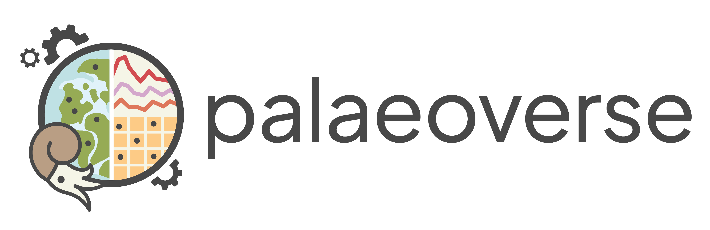

## Converting Users to Contributors: Enabling Sustainable Maintenance and Development of Palaeoverse

### Metadata

**Title:** Converting Users to Contributors: Enabling Sustainable Maintenance and Development of Palaeoverse 
**Funding Agency:** UKRI via the Software Sustainability Institute (Research Software Maintenance Fund awarded to [Lewis A. Jones](https://lewisajones.com))  
**Grant Reference:** AH/Z000114/1  
**Period:** 2026–2028  
**Lead:** [Lewis A. Jones](https://lewisajones.com), University College London, UK  
**Co-Leads:** Dr Bethany J. Allen, GFZ Helmholtz Centre for Geosciences, Germany **|** Dr Christopher D. Dean, Department of Energy Security and Net Zero, UK **|** Dr Harriet B. Drage, University of Lausanne, Switzerland **|** Dr Erin M. Dillon, Smithsonian Tropical Research Institute, Panama **|** Dr Joseph T. Flannery-Sutherland, University of Birmingham, UK **|** Dr William Gearty, Syracuse University, USA **|** Dr Pedro L. Godoy, University of São Paulo, Brazil

{width="25%"} {width="25%"} {width="25%"}

### Summary

Palaeoverse is an initiative aiming to unite the palaeontological community through shared resources, agreed standards, and a collective commitment to improving reproducibility in palaeontological research. The project began in 2022 when a group of early-career researchers recognised a common challenge: many of us were independently developing similar workflows for cleaning and preparing palaeontological data due to a lack of standardised tools and protocols, leading to duplicated work that was difficult to reproduce. In response, we came together to develop the palaeoverse R package--a toolkit designed to streamline data preparation and exploration in palaeontological research. Since then, Palaeoverse has evolved into a formally organised initiative with a growing scope. The organisation has expanded into a full software ecosystem, additionally running training workshops, producing community resources, and fostering spaces for networking.

Computational methods play an increasingly central role in palaeontology, creating a pressing need for reliable, community-endorsed software that supports reproducible research. Palaeoverse was established to address this demand, but its continued success now depends on broader community engagement to ensure its longevity and that its development reflects the diverse needs of the field, rather than those of its core contributors. As the project expands, reducing maintenance overhead and strengthening long-term sustainability remain critical challenges for safeguarding its future.

This project aims to evolve Palaeoverse into a community-driven project, where users actively contribute to the development, maintenance, and review of Palaeoverse software. To achieve this aim, we will: (a) foster a contributor-friendly environment for the Palaeoverse software ecosystem, and (b) grow community engagement and build a contributor network. These strategic priorities will be delivered through five key objectives: (1) audit and update existing Palaeoverse software packages to improve internal structure, code readability, and maintainability; (2) expand contributor guidelines and documentation to support community contributions; (3) develop and run community training events on research software development and maintenance; (4) develop and run a dedicated mentorship programme to train early-career researchers in research software development and maintenance; and (5) re-define Palaeoverse’s governance structure to support long-term strategic planning and drive towards community ownership.

This project will strengthen palaeontology’s software infrastructure by improving the sustainability and maintainability of the widely used Palaeoverse packages. It will foster a UK-focused, contributor-friendly community through training and engagement, equipping especially early career researchers with transferable computational and collaborative skills. Ultimately, the project will secure the UK’s leadership in palaeontological methods and serve as a model for sustainable, open-source research software development.

### Links

- [Website](https://palaeoverse.org)
- [GitHub repository](https://github.com/palaeoverse)

