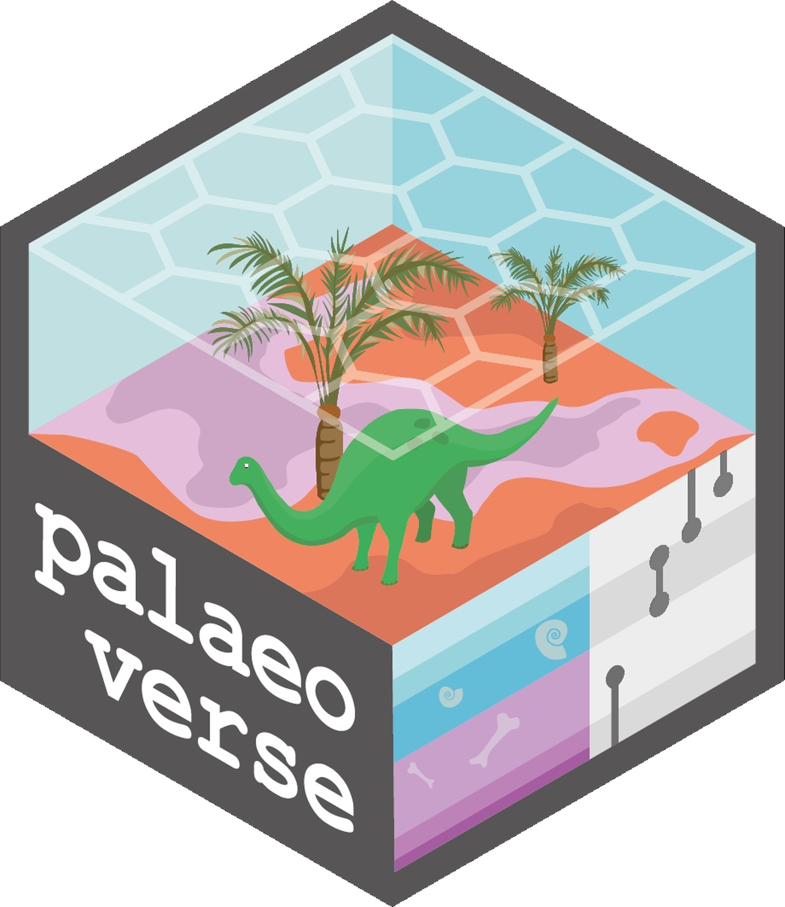
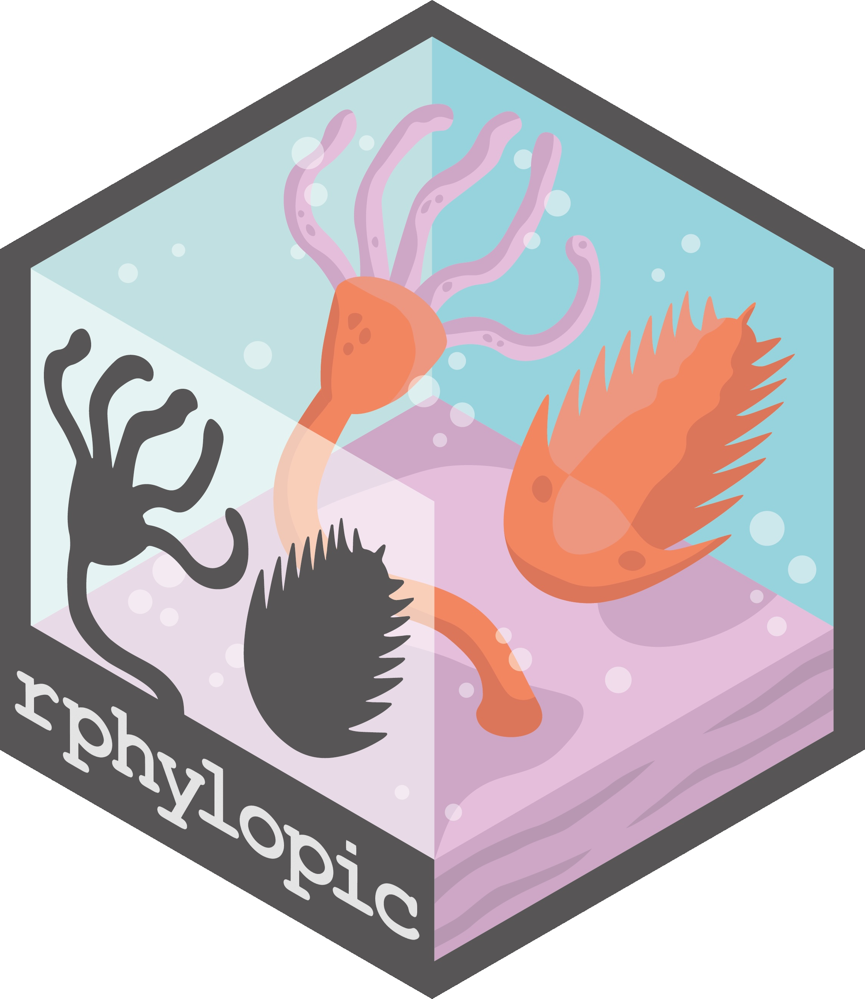
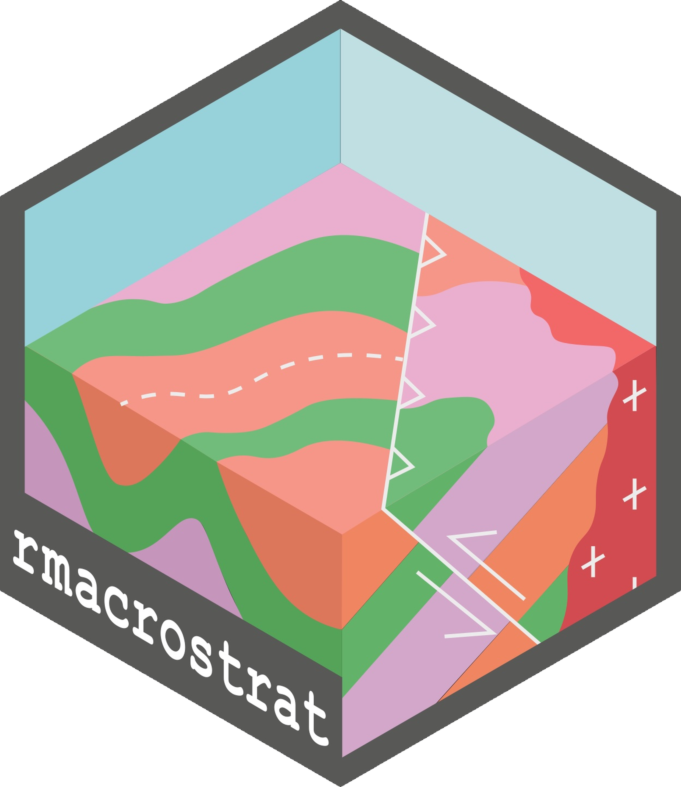
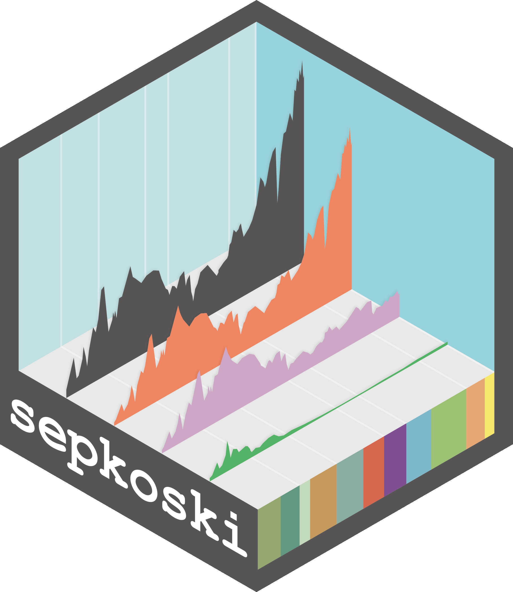

## [palaeoverse](http://palaeoverse.palaeoverse.org)

::: {.grid}

::: {.g-col-2}

{width=100%}

:::

::: {.g-col-10}

The `palaeoverse` R package is a community-driven toolkit to support the preparation and exploration of palaeobiological data. The package provides a suite of auxiliary functions, is open-source, and freely available from <a href="https://cran.r-project.org/web/packages/palaeoverse/index.html" style="text-decoration: none;">CRAN</a>. `palaeoverse` has three core principles: (1) streamline data preparation and exploration; (2) enhance code readability; and (3) improve reproducibility of results.

:::

:::

## [rphylopic](http://rphylopic.palaeoverse.org)

::: {.grid}

::: {.g-col-2}

{width=100%}

:::

::: {.g-col-10}

The `rphylopic` R package allows users to add silhouettes of organisms from <a href="http://phylopic.org/" target="_blank" style="text-decoration: none;">PhyloPic</a> to plots generated in base R and ggplot2.
The package is currently developed and maintained by myself and <a href="https://williamgearty.com" target="_blank" style="text-decoration: none;">William Gearty</a></a>
from the <a href="https://palaeoverse.org/" target="_blank" style="text-decoration: none;">Palaeoverse</a> team. The package is open-source, and freely available from <a href="https://cran.r-project.org/web/packages/rphylopic/index.html" style="text-decoration: none;">CRAN</a>.

:::

:::

## [rmacrostrat](http://rmacrostrat.palaeoverse.org)  

::: {.grid}

::: {.g-col-2}

{width=100%}

:::

::: {.g-col-10}

The `rmacrostrat` R package allows users to interfaces with the [Macrostrat](https://macrostrat.org){target="_blank"} database to access and retrieve a variety of geological, palaeontological, and economic data directly to the R environment. The package provides straightforward functionality for accessing and retrieving a variety of geological, palaeontological, and economic data hosted by Macrostrat. The package is open-source, and freely available from <a href="https://cran.r-project.org/web/packages/rmacrostrat/index.html" style="text-decoration: none;">CRAN</a>.

:::

:::

## [sepkoski](http://sepkoski.palaeoverse.org)

::: {.grid}

::: {.g-col-2}

{width=100%}

:::

::: {.g-col-10}

The `sepkoski` R package is a light and easy solution to access Sepkoski's fossil marine animal genera compendium (2002). The package provides access to the raw dataset, a dataset with intervals standardised to the International Geological Time Scale, and plotting functionality for reproducing Sepkoski's Phanerozoic curve. The package is open-source, and freely available from <a href="https://cran.r-project.org/web/packages/sepkoski/index.html" style="text-decoration: none;">CRAN</a>.

:::

:::
